# System Architecture - CCA CRM Sync Modernization

## Overview

This document provides a comprehensive view of the CCA CRM Sync Modernization system architecture. The system follows **Clean Architecture principles** combined with **Domain-Driven Design (DDD)** to create a maintainable, testable, and scalable platform for synchronizing customer and utility data between CCA systems and Dynamics 365.

## Architecture Goals

1. **Maintainability** - Clear separation of concerns with well-defined boundaries
2. **Testability** - Each layer can be tested independently with comprehensive test coverage
3. **Scalability** - Support for multi-tenant deployments with horizontal scaling
4. **Flexibility** - Easy to add new data sources or sync targets
5. **Reliability** - Robust error handling, retry mechanisms, and audit trails

## Core Principles

### Clean Architecture

The system is organized into concentric circles, with the Domain layer at the center:

- **Domain Layer** - Business rules, entities, aggregates, value objects (no external dependencies)
- **Application Layer** - Use cases, commands, queries, DTOs (depends only on Domain)
- **Infrastructure Layer** - Data access, external integrations (depends on Domain & Application)
- **Presentation Layer** - APIs, controllers, HTTP concerns (depends on all layers)

### Domain-Driven Design

The system models the business domain with:

- **Aggregates** - Customer, LdcAccount, SyncJob
- **Entities** - Strong identity within bounded context
- **Value Objects** - Immutable objects like EmailAddress, PhoneNumber, Address
- **Domain Events** - Published when important state changes occur
- **Repositories** - Abstract data access for aggregates

### CQRS (Command Query Responsibility Segregation)

Separates read and write operations:

- **Commands** - Operations that modify state (create, update, delete)
- **Queries** - Operations that retrieve data without side effects
- **Handlers** - Logic for processing commands and queries
- **Events** - Notifications of state changes for eventual consistency

## System Architecture Diagrams

### C4 Context Diagram

Shows the system in the context of its users and external systems:

```mermaid
graph TB
    User["👤 CCA Admin User"]
    CCA["CCA System"]
    Sync["🔄 CRM Sync Modernization"]
    Dyn365["Dynamics 365"]
    LDC["⚡ Utility Providers<br/>(PG&E, SCE, SDG&E)"]

    User -->|Uses| Sync
    CCA -->|Provides Data| Sync
    Sync -->|Syncs Customers<br/>& Usage Data| Dyn365
    LDC -->|Provides Usage<br/>& Billing Data| Sync

    style Sync fill:#4A90E2,stroke:#2E5C8A,color:#fff
    style Dyn365 fill:#E85D75,stroke:#A0354C,color:#fff
    style LDC fill:#7ED321,stroke:#5A9E1B,color:#fff
    style CCA fill:#FFB700,stroke:#B88700,color:#fff
```



### C4 Container Diagram

Shows the major containers (services, databases, APIs) and their interactions:


### C4 Component Diagram - Domain Layer

Shows the key components in the Domain layer:


### C4 Component Diagram - Application Layer

Shows the CQRS command/query structure:


### C4 Component Diagram - Infrastructure Layer

Shows data persistence and external integrations:


## Folder Structure and Conventions

```
cca-sync-modernization/
├── docs/
│   ├── architecture/           # Architecture documentation
│   │   └── README.md
│   ├── adrs/                  # Architecture Decision Records
│   │   ├── ADR-001-Clean-Architecture.md
│   │   ├── ADR-002-CQRS-Pattern.md
│   │   ├── ADR-003-Multi-Tenant-Design.md
│   │   ├── ADR-004-Database-Per-Tenant.md
│   │   └── ADR-005-Result-Pattern.md
│   ├── development/           # Developer guides
│   │   ├── SETUP.md
│   │   ├── CONTRIBUTING.md
│   │   ├── CODING-STANDARDS.md
│   │   ├── TESTING-GUIDE.md
│   │   └── DATABASE-GUIDE.md
│   └── project-plan/          # Project management
│
├── src/
│   ├── CCA.Sync.Domain/       # Domain layer - business logic
│   │   ├── Aggregates/
│   │   │   ├── Customer/
│   │   │   ├── LdcAccount/
│   │   │   ├── SyncJob/
│   │   │   ├── MonthlyUsage/
│   │   │   └── InvoiceHistory/
│   │   ├── ValueObjects/
│   │   ├── Enums/
│   │   ├── Events/
│   │   ├── Common/
│   │   └── Specifications/
│   │
│   ├── CCA.Sync.Application/  # Application layer - use cases
│   │   ├── Commands/
│   │   │   ├── Customers/
│   │   │   ├── LdcAccounts/
│   │   │   └── SyncJobs/
│   │   ├── Queries/
│   │   ├── Handlers/
│   │   ├── DTOs/
│   │   ├── Validators/
│   │   ├── MappingProfiles/
│   │   └── Behaviors/
│   │
│   ├── CCA.Sync.Infrastructure/  # Infrastructure layer
│   │   ├── Persistence/
│   │   │   ├── Configurations/
│   │   │   ├── Repositories/
│   │   │   ├── Interceptors/
│   │   │   └── Migrations/
│   │   ├── Integrations/
│   │   │   ├── Dynamics365/
│   │   │   └── LdcProviders/
│   │   ├── DomainEvents/
│   │   └── Caching/
│   │
│   ├── CCA.Sync.WebApi/       # Web API presentation layer
│   │   ├── Controllers/
│   │   ├── Middleware/
│   │   └── appsettings.*.json
│   │
│   ├── CCA.Sync.Worker/       # Background worker
│   │   ├── Jobs/
│   │   ├── Services/
│   │   └── HostedServices/
│   │
│   └── CCA.Sync.Shared/       # Shared utilities
│       ├── Constants/
│       ├── Extensions/
│       └── Utilities/
│
├── tests/
│   ├── Domain.Tests/          # Domain layer unit tests
│   ├── Application.Tests/      # Application layer unit tests
│   ├── Infrastructure.Tests/   # Infrastructure unit tests
│   └── Integration.Tests/      # E2E integration tests
│
├── .github/
│   ├── workflows/             # GitHub Actions CI/CD
│   └── ISSUE_TEMPLATE/        # Issue templates
│
├── scripts/                   # Build and deployment scripts
└── docker-compose.yml        # Local development environment
```

## Key Design Patterns

### 1. Result<T> Pattern

Used for operations that can fail without throwing exceptions:

```csharp
public Result<Customer> Create(CustomerName name, EmailAddress email)
{
    if (name == null) return Result<Customer>.Failure("Name required");
    return Result<Customer>.Success(new Customer(name, email));
}
```

### 2. Specification Pattern

Used for complex queries:

```csharp
var spec = new CustomersByTenantSpec(tenantId)
    .With(c => c.UtilityAccounts)
    .OrderBy(c => c.Name);
var customers = await repository.ListAsync(spec);
```

### 3. Repository Pattern

Generic, testable data access:

```csharp
public interface IRepository<T> where T : AggregateRoot
{
    Task<T?> GetByIdAsync(Guid id);
    Task<List<T>> ListAsync(ISpecification<T> spec);
    Task AddAsync(T entity);
    Task UpdateAsync(T entity);
    Task DeleteAsync(T entity);
}
```

### 4. Unit of Work Pattern

Transaction management:

```csharp
using (var uow = _unitOfWork.Begin())
{
    await _customerRepo.AddAsync(customer);
    await uow.SaveChangesAsync();
}
```

### 5. Domain Events

Notifications of important state changes:

```csharp
public class Customer : AggregateRoot
{
    public void AddUtilityAccount(UtilityAccount account)
    {
        UtilityAccounts.Add(account);
        RaiseDomainEvent(new UtilityAccountAddedEvent(Id, account.Id));
    }
}
```

## Multi-Tenancy Architecture

The system supports true multi-tenancy with database-per-tenant pattern:

- **TenantId** - Automatically set on all entities via interceptor
- **Tenant Filtering** - Queries automatically filtered by TenantId
- **Credential Encryption** - Separate encryption keys per tenant
- **Audit Trail** - CreatedBy, UpdatedBy with user context
- **Data Isolation** - No cross-tenant data leakage

## Technology Stack

| Layer | Technology | Version |
|-------|-----------|---------|
| **Framework** | .NET | 9.0 |
| **Language** | C# | 13 |
| **ORM** | Entity Framework Core | 9.0 |
| **Database** | PostgreSQL | 15+ |
| **CQRS** | MediatR | Latest |
| **Validation** | FluentValidation | Latest |
| **Mapping** | AutoMapper | Latest |
| **Logging** | Serilog | Latest |
| **Testing** | xUnit, Moq | Latest |
| **CI/CD** | GitHub Actions | - |

## Related Documents

- [ADR-001: Clean Architecture](../adrs/ADR-001-Clean-Architecture.md)
- [ADR-002: CQRS Pattern](../adrs/ADR-002-CQRS-Pattern.md)
- [ADR-003: Multi-Tenant Design](../adrs/ADR-003-Multi-Tenant-Design.md)
- [ADR-004: Database-Per-Tenant](../adrs/ADR-004-Database-Per-Tenant.md)
- [ADR-005: Result Pattern](../adrs/ADR-005-Result-Pattern.md)
- [Development Setup Guide](../development/SETUP.md)
- [Coding Standards](../development/CODING-STANDARDS.md)
